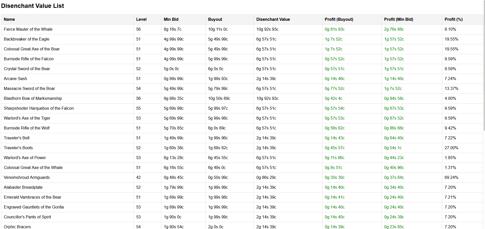

### Requirements: 

* WoW to scan AH data
* [AHDB](https://github.com/mooreatv/AuctionDB) to scan data ingame
* [AHDBapp](https://github.com/mooreatv/AHDBapp) to parse from lua to json and save to database.
* MYSQL Server for storing data

### Install
```
dotnet restore
```

From here simply add a .env file in root folder here with env configurations: 
```
DB_HOST=localhost
DB_PORT=3306
DB_USER=root
DB_PASSWORD=yourpassword
DB_NAME=ahdb
```

```
dotnet run
```

